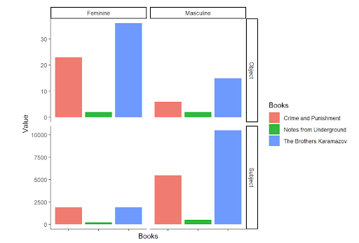

# Introduction
Fyodor Dostoevksy is a very popular Russian author from the mid 19th century. When faced with the prospect of doing a language processing project we thought that it would be interesting to work with Dostoevsky. While we did not explore the full depth of his work, this project could easily be expanded in a lot of interesting ways. Within this project, we took a look at how the usage of different genders as the subject of sentences or the object of sentences. 
# Methodology
### Data
For our data we used the online book texts from project Gutenberg. \
https://www.gutenberg.org/cache/epub/2554/pg2554.txt \
https://www.gutenberg.org/cache/epub/28054/pg28054.txt \
https://www.gutenberg.org/cache/epub/600/pg600.txt
### Libraries
We used Python SparkNLP pretrained “dependency parse” pipeline to extract the subjects and objects, pandas to export it to R where we performed some visualization with the ggplot package of the tidyverse.
### Code
With this chunk we start up the spark nlp object as well as import all the necessary libraries. AFter that we create a books directory and curl the text files into the directory
```{python}
!wget http://setup.johnsnowlabs.com/colab.sh -O - | bash
import sparknlp
spark = sparknlp.start()
import os
import pandas as pd
import nltk
nltk.download('punkt')  # Download the Punkt tokenizer models
from nltk.tokenize import sent_tokenize

from sparknlp.pretrained import PretrainedPipeline
pipeline = PretrainedPipeline("dependency_parse")

!mkdir books
!curl "https://www.gutenberg.org/cache/epub/600/pg600.txt" -o books/underground.txt
!curl "https://www.gutenberg.org/cache/epub/28054/pg28054.txt" -o books/brothers.txt
!curl "https://www.gutenberg.org/cache/epub/2554/pg2554.txt" -o books/candp.txt
```
Now we get into the program. First we created two functions that we will use later. First we will need a function to extract the subjects and objects from the sentence. Second we will need a function that keeps track of all the counts in the text.
```{python}
def extract_subjects_objects(data):
    subjects = []
    objects = []

    for dep, word in zip(data[2], data[3]):
        if dep in ['nsubj', 'nsubjpass']:  # Nominal subjects (active and passive)
            subjects.append(word.lower())
        elif dep in ['dobj', 'iobj', 'pobj']:  # Direct objects, indirect objects, and objects of prepositions
            objects.append(word.lower())

    return subjects, objects

def count_filtered_pronouns(subjects, objects, feminine_pronouns, masculine_pronouns):
    counts_dict = {
        'feminine_subjects': 0,
        'feminine_objects': 0,
        'masculine_subjects': 0,
        'masculine_objects': 0
    }

    for subject in subjects:
        if subject in feminine_pronouns:
            counts_dict['feminine_subjects'] += 1
        elif subject in masculine_pronouns:
            counts_dict['masculine_subjects'] += 1

    for obj in objects:
        if obj in feminine_pronouns:
            counts_dict['feminine_objects'] += 1
        elif obj in masculine_pronouns:
            counts_dict['masculine_objects'] += 1

    return counts_dict
```
Now we loop through each of the files and use the pipeline to analyze and annotate the texts. We then use the above functions to break down the dictionary output that we get from the file. After that we print out the results.
```{python}
#Assuming your functions extract_subjects_objects and count_filtered_pronouns are defined as before
books_directory = 'books'

#Initialize an empty list to store counts dicts
rows = []

#Lists of masculine and feminine pronouns (both lowercase)
feminine_pronouns = ["she", "her", "hers"]
masculine_pronouns = ["he", "him", "his"]

#Iterate through each file in the directory
for filename in os.listdir(books_directory):
    if filename.endswith('.txt'):
        file_path = os.path.join(books_directory, filename)
        print(file_path)
        with open(file_path, 'r', encoding='utf-8') as file:
            lines = file.readlines()
            text = ''.join(lines[50:])
            sentences = sent_tokenize(text)
            sentences_list = []
            for sentence in sentences:
                sentences_list.append(sentence)

            # Annotate sentences with your pipeline
            dfs = pipeline.annotate(sentences_list)
            all_subjects = []
            all_objects = []

            # Extract subjects and objects from each annotated dataframe
            for df in dfs:
                subjects, objects = extract_subjects_objects(list(df.values()))
                all_subjects.extend(subjects)
                all_objects.extend(objects)

            # Get counts of filtered pronouns
            counts_dict = count_filtered_pronouns(all_subjects, all_objects, feminine_pronouns, masculine_pronouns)

            # Add the filename to the counts_dict
            counts_dict['filename'] = filename

            # Append counts to the list of rows
            rows.append(counts_dict)

#Create DataFrame from the list of rows
df_counts = pd.DataFrame(rows)
print(df_counts)
```

Because there are so few values we just created a tibble from the values. It's a little different from the format outputted from the python because tidy format makes graphics easier. If you want to reproduce this, use your own values for the value vector.
```{r}
library(tidyverse)
df_2 <- tibble(
  Books = c("Crime and Punishment","Notes from Underground", "The Brothers Karamazov","Crime and Punishment","Notes from Underground", "The Brothers Karamazov","Crime and Punishment","Notes from Underground", "The Brothers Karamazov","Crime and Punishment","Notes from Underground", "The Brothers Karamazov"),
  Sex = c("Feminine","Feminine","Feminine","Feminine","Feminine","Feminine","Masculine","Masculine","Masculine","Masculine","Masculine","Masculine"),
  Word_Type = c("Subject","Subject","Subject","Object","Object","Object","Subject","Subject","Subject","Object","Object","Object"),
  Value = c(1898,237,1905,23,2,36,5496,521,10493,6,2,15)
)
```
There will be more code that is shown in the results section for the rest.
# Hypothesis
Having read some of the books, we think that it is likely that men will be both subjects and objects of the sentence at a higher frequency than women. There are a few prominent female characters, but overall, the main characters are male.

In a statistical sense, we are testing the null hypothesis that there is no difference in the true percentage of subjects and objects of sentences between the sexes when Dostoevsky wrote novels.
# Results
We used the output of the above tibble to produce a graphic with the following r code
```{r}
df_2 %>% 
  ggplot() + 
  geom_col(aes(x=Books,y=Value,fill=Books)) + 
  facet_grid(Word_Type~Sex,scales = "free_y") + 
  theme_classic() + 
  theme(axis.text.x = element_blank())
```



We also did a couple chi-squared tests with the following code. The tests is whether there is a significantly significant difference between the male and female subjects and objects for both the different books and the collective works.
```{r}

df_3 <- tibble(
  Books = c("Crime and Punishment","Notes from Underground", "The Brothers Karamazov"),
  "Masculine Subjects" = c(5496,521,10493),
  "Total Subjects" = c(7842,758,12398),
  p0 = c(0.5,0.5,0.5)
)


result1 <- prop.test(6,29,0.5,alternative = "two.sided")
result2 <- prop.test(2,4,0.5,alternative = "two.sided")
result3 <- prop.test(15,51,0.5,alternative = "two.sided")

result1
result2
result3

prop.test(16510,20548,0.5,alternative = "two.sided")

prop.test(23,84,0.5,alternative = "two.sided")
```

# Conclusion
The graphic shows us that feminine pronouns are generally the object in sentences when the show up, while male pronouns are generally the subject. This is rather different than the hypothesis. We also performed some chi-squared tests. All the results that we got had a p-value that was below 0.05 and as such is considered statistically significant. The only exception is notes from underground which is pretty much just one guy ruminating on the world alone so it makes sense to have only male characters. The angle from the individual books means that if the book had like 100 more chapters, the two numbers would remain different in the same way. On the other hand, the collective works would signify that if Dostoevsky continued to write, it is more likely than not that there would be more male subjects and female objects. 